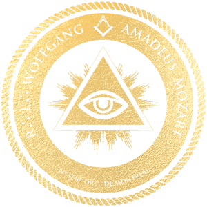

# La masonería

  

Como todo tiene que tener un origen certero para ser creíble, los historiadores dan como cierto el año de 1717 como el inicio de la Masonería Moderna. Trescientos años de evolución después de un origen venido de la llamada Masonería Operativa, de los oficios de la construcción de catedrales y de otro tipo de edificaciones religiosas, laicas o civiles como fortalezas o castillos, que fueron erigidas por miembros de las corporaciones, guildas o gremios de talladores, canteros y albañiles asalariados de la Edad Media, cuyas ramificaciones se extendían desde el Medio Oriente a toda Europa Occidental. De igual manera, hay que tener en cuenta que estudiosos de las fuentes históricas, literarias, filosóficas y sociológicas de la Masonería y de la tesis de su transición, como los Quatuor Coronati, afirman que la Masonería Moderna es solo una etapa histórica más en la evolución de esta institución. 

Que hay que ir más atrás en la línea del tiempo, a la Antigüedad, para así encontrar el origen remoto de la transmisión iniciática del Arte Real o primer arte practicado por la Humanidad de los trabajadores de la piedra, la madera, el bronce o del hierro, el cual ha ido heredándose a través las Edades.

La Masonería Moderna es una institución de carácter iniciático, filosófico, filantrópico y moral que trabaja con alegorías, que enseña y transmite con símbolos masónicos el cuestionarse sobre sí mismo, sobre el camino de esclarecimiento individual, con el fin de que haya un autodescubrimiento y autoexpresión, para eventualmente encontrar la mejor versión de uno mismo, por uno mismo y poder llegar a conocer y comprender el Mundo que nos rodea y a la sociedad actual en la que vivimos.

## El Derecho Humano

### Ordre Maçonnique International "Le Droit Humain"
 
La Orden Masónica Mixta Internacional El Derecho Humano es una institución masónica fundada por Georges Martin y Marie Deraismes el 4 de abril de 1893 en Paris, Francia, tras la Revolución de 1848 y la instauración de la Segunda República. Se le considera la Obediencia madre de la Masonería Mixta y fruto de la evolución de diferentes corrientes del pensamiento influenciadas por el laicismo, movimientos libertarios y progresistas. Ella ha sabido perdurar apoyándose en su historia, adaptándose a su época y yendo hacia adelante celebrado sus 125 años de existencia este 2018.

Como bien lo afirman los tres primeros artículos de su Constitución Internacional, su cometido principal se basa en el método masónico de trabajo, fiel al laicismo que afirma la igualdad entre hombres y mujeres, que permite el acceso a las mujeres a talleres masónicos; y que trabaja en unión fraterna, en el amor hacia la Humanidad, en el perfeccionamiento individual y en la justicia social; ejercitando los principios de Libertad, Igualdad y Fraternidad para obtener el deseado desarrollo moral, intelectual y espiritual básico de la felicidad y bienestar humanos.

La Orden Masónica Mixta Internacional El Derecho Humano trabaja el Rito Escocés Antiguo y Aceptado en 33 grados de la Francmasonería. Está presente en más de 50 países y cuenta con más de 28 000 miembros a través de los 5 continentes. Cada país cuenta con sus logias pioneras, federaciones, o jurisdicciones, dependiendo de cada autonomía cara a la Orden. Canadá cuenta con la Federación Canadiense del Derecho Humano, la cual trabaja en francés, inglés y en español; y cuenta con 10 logias en todo Canadá. Y muy pronto otros talleres verán la luz.

### Logia W. A. Mozart No. 1740 de Montreal 

La Logia W. A. Mozart No. 1740 está compuesta por francmasones hombres y mujeres muy diferentes entre sí pero fraternalmente unidos que trabajan la Masonería mixta en lengua española. La Logia W. A. Mozart está conformada por canadienses y por inmigrantes originarios de países de habla hispana, de España e Hispanoamérica, los cuales son ciudadanos activos y trabajadores comprometidos en mejorar la sociedad canadiense.

La Logia W. A. Mozart trabaja en sus sesiones de manera individual y colectiva temas tan variados como son, entre otros, la simbología Masónica, el aspecto histórico y social del diario vivir, la Conciencia del Ser y el desarrollo humano moral, intelectual y espiritual, poniendo en práctica el libre pensamiento, alejado de todo dogmatismo. Se trabaja por un mundo más humano en un plano de igualdad y de justicia social. A sus miembros se les invita a reflexionar en ello y a compartir las diversas opiniones con los otros francmasones siendo siempre tolerantes y respetuosos de la libertad de conciencia del Otro, regidos siempre bajo los principios de Libertad, Igualdad y Fraternidad.

La logia W. A. Mozart acepta a personas sin ninguna distinción social, étnica, filosófica o religiosa. Cree que cada quien asume su responsabilidad masónica de acuerdo a sus capacidades.

En definitiva, si usted es afin a lo antes descrito y le interesa progresar como persona, le invitamos a ingresar y/o afiliarse (si usted ya es francmasón de otra Institución) a la Logia W. A. Mozart. Para ello, es muy importante ser mayor de edad, ser residente permanente y/o ciudadano canadiense, estudiar y/o trabajar, comprometerse a asistir asiduamente a los talleres, a trabajar con alegría y fraternidad; y a pagar las cuotas sin falta o retraso. Sepa que el juramento masónico es vitalicio y exige estricto cumplimiento, analice bien sus prioridades y decida libremente.

Para mayor información comunicarse con nosotros por medio de nuestra pagina de [contacto](/contact-us).
